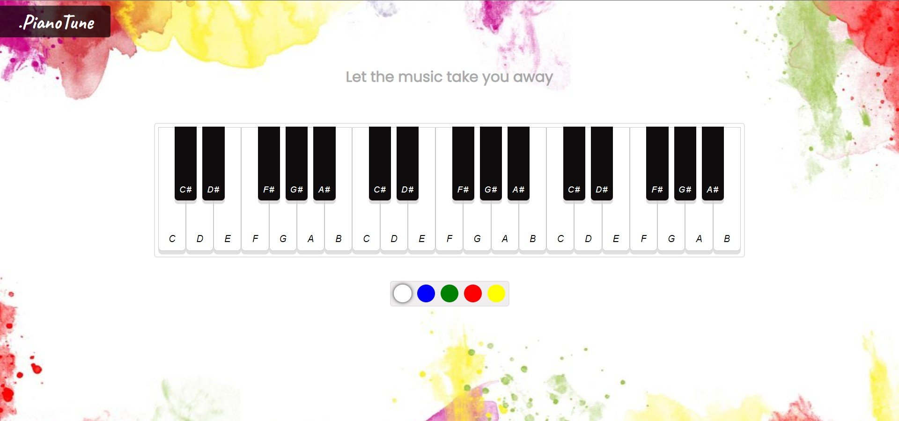

<div id="top"></div>

<br />
<div align="center">
  <h1 align="center">Piano Tune</h1>

  <p align="center">
    Enjoy the sound of virtual piano.
  </p>
</div>

## About The Project



i create piano with 36 keys and with different colors.

Here's why:

- to learn media tags in html.

and i really enjoy playing piano while building this project.

## Demo

Here is a quick demo of the app. I hope you enjoy it.

> [The Demo Link](https://naim30.github.io/piano-tune/)

## Built With

To build this Landing page I used..

- HTML
- CSS
- JAVASCRIPT

## Getting Started

you do not need any prerequisites for this project just clone the repo and open `index.html` in browser.

Clone the repo

```sh
git clone https://github.com/naim30/piano-tune.git
```

## Contact

Naimish Lukhi :
Email - naimlukhi30@gmail.com :
[LinkedIn](https://www.linkedin.com/in/naimish-lukhi-a2b14a1b9)

Project Link: [https://github.com/naim30/piano-tune](https://github.com/naim30/piano-tune)

<p align="right">(<a href="#top">back to top</a>)</p>
